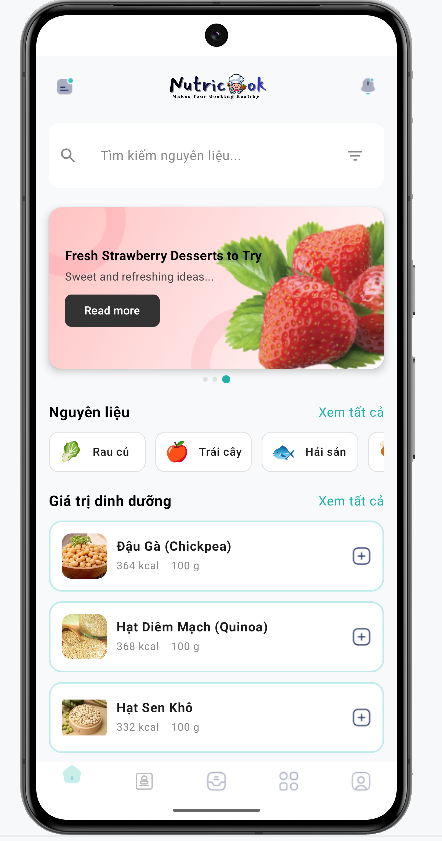
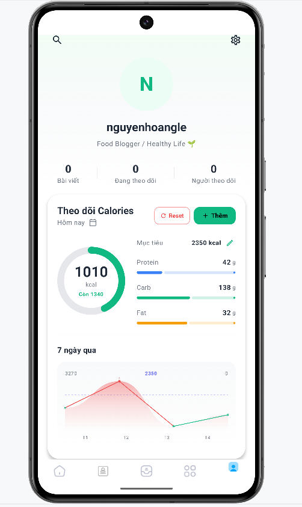
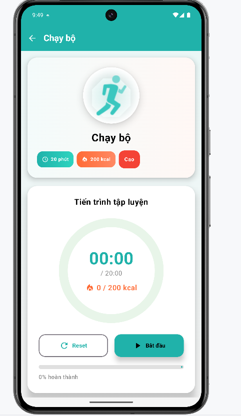
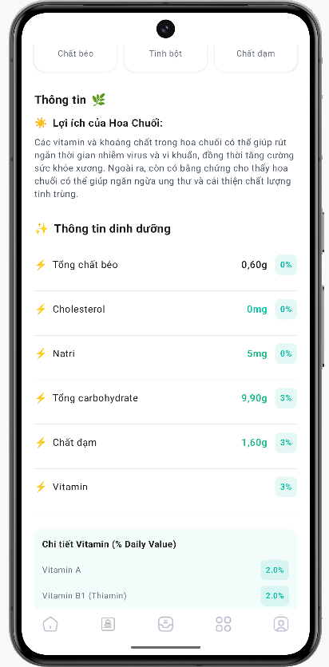
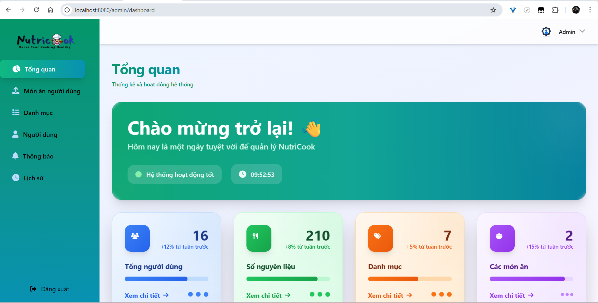
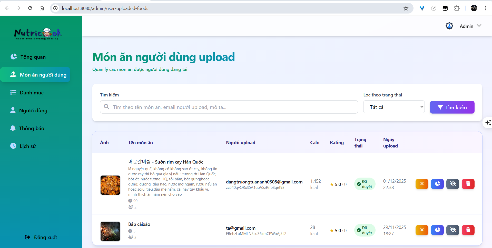
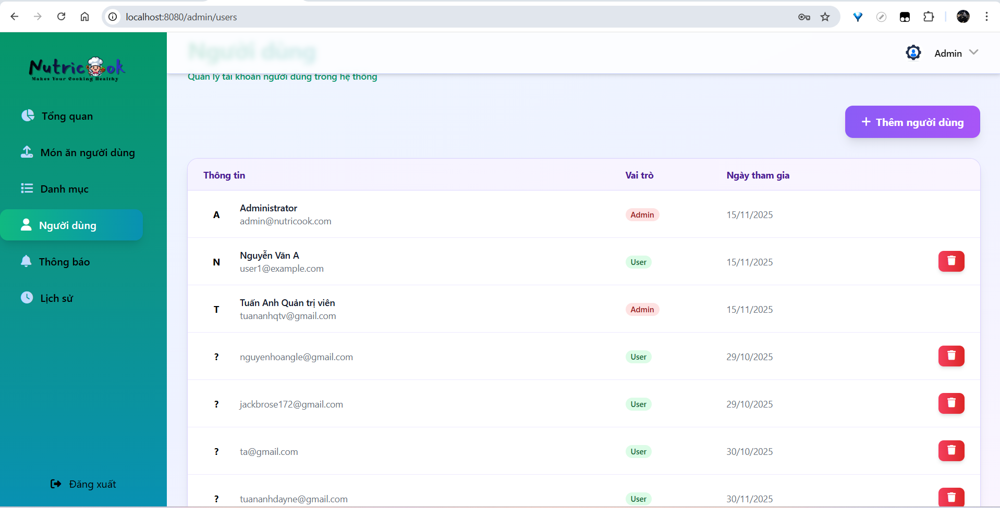
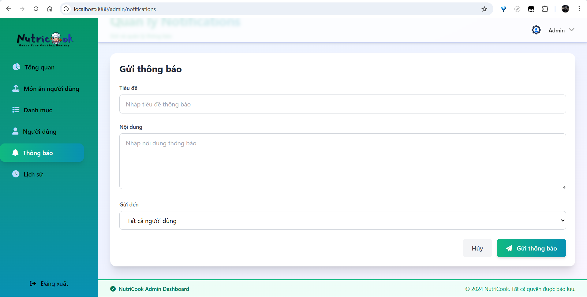

<div align="center">

# 🍳 NutriCook

**Hệ thống quản lý dinh dưỡng toàn diện - Makes Your Cooking Healthy**

[](https://www.android.com/)
[](https://kotlinlang.org/)
[](https://spring.io/projects/spring-boot)
[](https://firebase.google.com/)
[](LICENSE)

[Features](#-tính-năng) • [Screenshots](#-hình-ảnh) • [Tech Stack](#-công-nghệ) • [Installation](#-cài-đặt) • [Documentation](#-tài-liệu)

</div>

---

## 📖 Giới thiệu

**NutriCook** là hệ thống quản lý dinh dưỡng toàn diện, giúp người dùng xây dựng chế độ ăn uống lành mạnh và khoa học. Hệ thống bao gồm ứng dụng mobile Android và dashboard quản trị web, được xây dựng với công nghệ hiện đại và giao diện thân thiện.

### 🎯 Mục tiêu

- ✅ Theo dõi dinh dưỡng hàng ngày (Calories, Protein, Fat, Carb)
- ✅ Quản lý công thức nấu ăn với tính toán dinh dưỡng tự động
- ✅ Tập thể dục và theo dõi calories đốt cháy
- ✅ Tìm kiếm thực phẩm và công thức thông minh
- ✅ Quản lý người dùng và dữ liệu qua Admin Dashboard

---

## ✨ Tính năng

### 📱 Mobile App (Android)

#### 🔐 Xác thực & Bảo mật
- ✅ Đăng nhập/Đăng ký với Firebase Authentication
- ✅ Xác thực email (Email Verification)
- ✅ Đăng nhập bằng Google & Facebook
- ✅ Xác thực số điện thoại (OTP)
- ✅ Quên mật khẩu với deep link

#### 🍽️ Quản lý Dinh dưỡng
- ✅ Thêm bữa ăn (Sáng, Trưa, Tối, Phụ)
- ✅ Tính calories tự động bằng AI (Google Gemini)
- ✅ Tính dinh dưỡng từ nguyên liệu
- ✅ Theo dõi dinh dưỡng hàng ngày
- ✅ Biểu đồ tiến độ 7 ngày
- ✅ Vòng tròn calories với animation

#### 🍳 Công thức Nấu ăn
- ✅ Tạo công thức mới với nguyên liệu
- ✅ Tính dinh dưỡng tự động từ nguyên liệu
- ✅ Upload ảnh món ăn (Cloudinary)
- ✅ Xem công thức chi tiết với bước nấu
- ✅ Tìm kiếm công thức thông minh

#### 🏃 Tập thể dục
- ✅ Chọn bài tập (Đạp xe, Đi bộ, Yoga, Bơi lội, etc.)
- ✅ Timer đếm thời gian với Foreground Service
- ✅ Tính calories đốt cháy theo thời gian thực
- ✅ Tạm dừng/Tiếp tục từ notification
- ✅ Resume exercise đang dừng (thông minh)

#### 🔍 Tìm kiếm
- ✅ Tìm kiếm đa dạng: Recipes, Food Items, Hot News
- ✅ Tìm kiếm đa từ (multi-word search)
- ✅ Real-time search results
- ✅ Filter và sort kết quả

#### 🔔 Thông báo
- ✅ Thông báo định kỳ (7h sáng, 12h trưa, 19h tối)
- ✅ Push notification từ Admin
- ✅ Notification khi tập thể dục
- ✅ Hiển thị trên lock screen

### 🌐 Admin Dashboard (Web)

#### 👥 Quản lý Người dùng
- ✅ Xem danh sách tất cả users
- ✅ Thống kê users (số lượng, hoạt động)
- ✅ Xem chi tiết user (bữa ăn, calories, recipes)

#### 🥬 Quản lý Thực phẩm
- ✅ CRUD operations cho foods
- ✅ Upload ảnh thực phẩm
- ✅ Quản lý categories
- ✅ Import/Export Excel

#### 🍳 Quản lý Công thức
- ✅ Xem tất cả recipes từ users
- ✅ Phê duyệt/từ chối recipes
- ✅ Chỉnh sửa recipes

#### 📊 Analytics & Thống kê
- ✅ Dashboard với charts (Chart.js)
- ✅ Thống kê calories trung bình
- ✅ Thống kê users, recipes, foods
- ✅ Export dữ liệu ra Excel

#### 📢 Gửi Thông báo
- ✅ Gửi push notification đến tất cả users
- ✅ Gửi đến nhóm users (active, new users)
- ✅ Preview notification trước khi gửi

---

## 📸 Hình ảnh

### 📱 Mobile App

<div align="center">

#### QR Code để tải ứng dụng


*Quét mã QR để tải ứng dụng NutriCook*

---

#### Màn hình chính (Home Screen)



*Màn hình chính với tìm kiếm, danh mục, và thông tin dinh dưỡng*

---

#### Màn hình theo dõi dinh dưỡng



*Theo dõi calories, protein, fat, carb với biểu đồ trực quan*

---

#### Màn hình tập thể dục



*Timer tập thể dục với vòng tròn progress và tính calories đốt cháy*

---

#### Màn hình công thức



*Tạo và xem công thức nấu ăn với tính dinh dưỡng tự động*

</div>

### 🌐 Admin Dashboard

<div align="center">

#### Dashboard Overview



*Tổng quan hệ thống với thống kê và biểu đồ*

---

#### Quản lý Thực phẩm



*Quản lý thực phẩm với CRUD operations và upload ảnh*

---

#### Quản lý Người dùng



*Quản lý users với thống kê và chi tiết*

---

#### Gửi Thông báo



*Gửi push notification đến users*

</div>

---

## 🛠️ Công nghệ

### 📱 Mobile App

| Category | Technology |
|----------|-----------|
| **Language** | Kotlin 100% |
| **UI Framework** | Jetpack Compose (Material Design 3) |
| **Architecture** | MVVM (Model-View-ViewModel) |
| **Dependency Injection** | Hilt |
| **Database** | Firebase Firestore (Cloud), Room (Local) |
| **Authentication** | Firebase Authentication |
| **Image Loading** | Coil |
| **Image Upload** | Cloudinary SDK |
| **Push Notifications** | Firebase Cloud Messaging (FCM) |
| **Navigation** | Navigation Compose |
| **Async** | Kotlin Coroutines & Flow |
| **AI Integration** | Google Gemini API |

### 🌐 Admin Dashboard

| Category | Technology |
|----------|-----------|
| **Framework** | Spring Boot 3.1.5 |
| **Language** | Java 17 |
| **Template Engine** | Thymeleaf |
| **Database** | MySQL, Firebase Firestore |
| **UI Framework** | Tailwind CSS |
| **Icons** | Font Awesome |
| **Charts** | Chart.js |
| **Build Tool** | Maven |
| **Security** | Spring Security |

### ☁️ Backend Services

| Service | Purpose |
|---------|---------|
| **Firebase Authentication** | User authentication (Email, Phone, Google, Facebook) |
| **Cloud Firestore** | Real-time NoSQL database |
| **Cloud Storage** | File storage (images) |
| **Firebase Cloud Messaging** | Push notifications |
| **Cloudinary** | Image hosting & optimization |
| **Google Gemini API** | AI tính calories tự động |

---

## 🏗️ Kiến trúc

### Mobile App Architecture

```
┌─────────────────────────────────────────────────────────┐
│                    UI Layer (Compose)                   │
│  ┌──────────────┐  ┌──────────────┐  ┌──────────────┐ │
│  │ HomeScreen   │  │ ProfileScreen│  │ RecipeScreen │ │
│  └──────┬───────┘  └──────┬───────┘  └──────┬───────┘ │
└─────────┼──────────────────┼──────────────────┼─────────┘
          │                  │                  │
┌─────────▼──────────────────▼──────────────────▼─────────┐
│              ViewModel Layer (MVVM)                      │
│  ┌──────────────┐  ┌──────────────┐  ┌──────────────┐ │
│  │ HomeViewModel│  │ ProfileViewModel│ │ RecipeViewModel│
│  └──────┬───────┘  └──────┬───────┘  └──────┬───────┘ │
└─────────┼──────────────────┼──────────────────┼─────────┘
          │                  │                  │
┌─────────▼──────────────────▼──────────────────▼─────────┐
│              Repository Layer                             │
│  ┌──────────────┐  ┌──────────────┐  ┌──────────────┐ │
│  │ AuthRepo     │  │ NutritionRepo│  │ RecipeRepo    │ │
│  └──────┬───────┘  └──────┬───────┘  └──────┬───────┘ │
└─────────┼──────────────────┼──────────────────┼─────────┘
          │                  │                  │
┌─────────▼──────────────────▼──────────────────▼─────────┐
│              Data Source Layer                            │
│  ┌──────────────┐  ┌──────────────┐  ┌──────────────┐ │
│  │ Firebase      │  │ Room DB      │  │ Cloudinary    │ │
│  │ Firestore    │  │ (Local Cache)│  │ (Images)      │ │
│  └──────────────┘  └──────────────┘  └──────────────┘ │
└─────────────────────────────────────────────────────────┘
```

### Dashboard Architecture

```
┌─────────────────────────────────────────────────────────┐
│              View Layer (Thymeleaf Templates)          │
│  ┌──────────────┐  ┌──────────────┐  ┌──────────────┐ │
│  │ Dashboard    │  │ Users        │  │ Foods        │ │
│  └──────┬───────┘  └──────┬───────┘  └──────┬───────┘ │
└─────────┼──────────────────┼──────────────────┼─────────┘
          │                  │                  │
┌─────────▼──────────────────▼──────────────────▼─────────┐
│              Controller Layer (MVC)                      │
│  ┌──────────────┐  ┌──────────────┐  ┌──────────────┐ │
│  │ AdminController│ │ ApiController│ │ FirestoreController│
│  └──────┬───────┘  └──────┬───────┘  └──────┬───────┘ │
└─────────┼──────────────────┼──────────────────┼─────────┘
          │                  │                  │
┌─────────▼──────────────────▼──────────────────▼─────────┐
│              Service Layer                               │
│  ┌──────────────┐  ┌──────────────┐  ┌──────────────┐ │
│  │ FirestoreService│ │ NotificationService│ │ CloudinaryService│
│  └──────┬───────┘  └──────┬───────┘  └──────┬───────┘ │
└─────────┼──────────────────┼──────────────────┼─────────┘
          │                  │                  │
┌─────────▼──────────────────▼──────────────────▼─────────┐
│              Data Layer                                  │
│  ┌──────────────┐  ┌──────────────┐                    │
│  │ MySQL        │  │ Firebase     │                    │
│  │ (Local DB)   │  │ Firestore    │                    │
│  └──────────────┘  └──────────────┘                    │
└─────────────────────────────────────────────────────────┘
```

---

## 🚀 Cài đặt

### 📋 Yêu cầu

- **Android Studio** Hedgehog | 2023.1.1 hoặc mới hơn
- **JDK** 17 hoặc mới hơn
- **Node.js** 18+ (cho Tailwind CSS)
- **MySQL** 8.0+ (cho Dashboard)
- **Firebase Account** (Authentication, Firestore, Storage, FCM)

### 📱 Mobile App

1. **Clone repository**
   ```bash
   git clone https://github.com/yourusername/NutriCook.git
   cd NutriCook/mobile
   ```

2. **Cấu hình Firebase**
   - Tạo Firebase project tại [Firebase Console](https://console.firebase.google.com/)
   - Download `google-services.json` và đặt vào `mobile/app/`
   - Bật các services: Authentication, Firestore, Storage, Cloud Messaging

3. **Cấu hình API Keys**
   - Tạo file `mobile/app/secrets.properties`:
     ```properties
     GEMINI_API_KEY=your_gemini_api_key
     CLOUDINARY_API_KEY=your_cloudinary_key
     CLOUDINARY_API_SECRET=your_cloudinary_secret
     ```

4. **Build và chạy**
   ```bash
   ./gradlew assembleDebug
   # Hoặc mở project trong Android Studio và chạy
   ```

### 🌐 Admin Dashboard

1. **Cấu hình Database**
   ```bash
   cd NutriCook/dashboard
   # Tạo MySQL database
   mysql -u root -p
   CREATE DATABASE nutricook_db;
   ```

2. **Cấu hình Firebase**
   - Download `serviceAccountKey.json` từ Firebase Console
   - Đặt vào `dashboard/src/main/resources/`

3. **Cấu hình application.properties**
   ```properties
   # Database
   spring.datasource.url=jdbc:mysql://localhost:3306/nutricook_db
   spring.datasource.username=root
   spring.datasource.password=your_password
   
   # Firebase
   firebase.enabled=true
   ```

4. **Build và chạy**
   ```bash
   mvn clean install
   mvn spring-boot:run
   # Hoặc
   java -jar target/dashboard-0.0.1-SNAPSHOT.jar
   ```

5. **Truy cập Dashboard**
   - Mở browser: `http://localhost:8080`
   - Đăng nhập với admin credentials

---

## 📚 Tài liệu

### 📖 Documentation

Chi tiết về từng phần của hệ thống:

- 📘 [Câu chuyện hệ thống](dashboard/docs/SYSTEM_STORY.md) - Hướng dẫn dễ hiểu cho người mới
- 🏗️ [Kiến trúc hệ thống](dashboard/docs/ARCHITECTURE.md) - Monolithic & MVC pattern
- 🔥 [Firebase Implementation](dashboard/docs/FIREBASE_IMPLEMENTATION_GUIDE.md) - Chi tiết về Firebase
- 🎨 [UI Libraries Guide](dashboard/docs/UI_LIBRARIES_GUIDE.md) - Thư viện UI sử dụng
- 🔔 [Notification System](dashboard/docs/NOTIFICATION_SYSTEM_IMPLEMENTATION.md) - Hệ thống thông báo
- 🔥 [Calorie Burning System](dashboard/docs/CALORIE_BURNING_SYSTEM.md) - Đốt calories khi tập thể dục
- 📊 [Calorie Calculation](dashboard/docs/CALORIE_CALCULATION_SYSTEM.md) - Tính calories tự động

### 🔍 Quick Links

- [Mobile App README](mobile/README.md)
- [Dashboard Setup](dashboard/FIREBASE_SETUP.md)
- [Spring Boot Basics](dashboard/docs/SPRING_BOOT_BASICS.md)

---

## 🎯 Tính năng nổi bật

### 🤖 AI Tính Calories Tự động

Sử dụng **Google Gemini API** để tính dinh dưỡng tự động từ tên món ăn:

```
Input: "1 quả táo"
Output: { calories: 52, protein: 0.3, fat: 0.2, carb: 14 }
```

### 🔄 Real-time Sync

Dữ liệu đồng bộ real-time giữa mobile app và dashboard qua **Firebase Firestore**:

- Thêm bữa ăn trên mobile → Dashboard cập nhật ngay
- Admin thêm thực phẩm → Mobile app cập nhật ngay

### 🏃 Exercise với Foreground Service

- Timer chạy nền ngay cả khi app đóng
- Notification hiển thị tiến trình
- Resume exercise đang dừng từ notification

### 📊 Analytics Dashboard

- Biểu đồ calories 7 ngày
- Thống kê users, recipes, foods
- Export dữ liệu ra Excel

---

## 📁 Cấu trúc Project

```
NutriCook/
├── mobile/                 # Android App
│   ├── app/
│   │   ├── src/main/
│   │   │   ├── java/com/example/nutricook/
│   │   │   │   ├── data/          # Data layer
│   │   │   │   ├── viewmodel/     # ViewModel layer
│   │   │   │   ├── view/          # UI screens
│   │   │   │   └── utils/         # Utilities
│   │   │   └── res/               # Resources
│   │   └── build.gradle.kts
│   └── build.gradle.kts
│
├── dashboard/              # Admin Dashboard
│   ├── src/main/
│   │   ├── java/com/nutricook/dashboard/
│   │   │   ├── controller/        # Controllers
│   │   │   ├── service/           # Services
│   │   │   ├── repository/       # Repositories
│   │   │   └── entity/           # Entities
│   │   └── resources/
│   │       ├── templates/        # Thymeleaf templates
│   │       └── static/           # CSS, JS, images
│   └── pom.xml
│
└── docs/                   # Documentation
    └── dashboard/docs/
        ├── SYSTEM_STORY.md
        ├── ARCHITECTURE.md
        └── ...
```

---

## 🤝 Đóng góp

Chúng tôi hoan nghênh mọi đóng góp! Vui lòng:

1. Fork project
2. Tạo feature branch (`git checkout -b feature/AmazingFeature`)
3. Commit changes (`git commit -m 'Add some AmazingFeature'`)
4. Push to branch (`git push origin feature/AmazingFeature`)
5. Mở Pull Request

### 📝 Coding Standards

- **Kotlin:** Follow [Kotlin Coding Conventions](https://kotlinlang.org/docs/coding-conventions.html)
- **Java:** Follow [Google Java Style Guide](https://google.github.io/styleguide/javaguide.html)
- **Commit messages:** Use conventional commits format

---

## 📄 License

Distributed under the MIT License. See `LICENSE` for more information.

---

## 👨‍💻 Tác giả

**NutriCook Team**

- GitHub: [@nguyenhoangle0701](https://github.com/nguyenhoangle0701)
- Email: contact@nutricook.com

---

## 🙏 Lời cảm ơn

- [Firebase](https://firebase.google.com/) - Backend services
- [Jetpack Compose](https://developer.android.com/jetpack/compose) - UI framework
- [Spring Boot](https://spring.io/projects/spring-boot) - Web framework
- [Tailwind CSS](https://tailwindcss.com/) - CSS framework
- [Google Gemini](https://gemini.google.com/) - AI API

---

<div align="center">

### ⭐ Nếu project này hữu ích, hãy cho một star! ⭐

**Made with ❤️ by NutriCook Team**

[⬆ Back to Top](#-nutricook)

</div>

